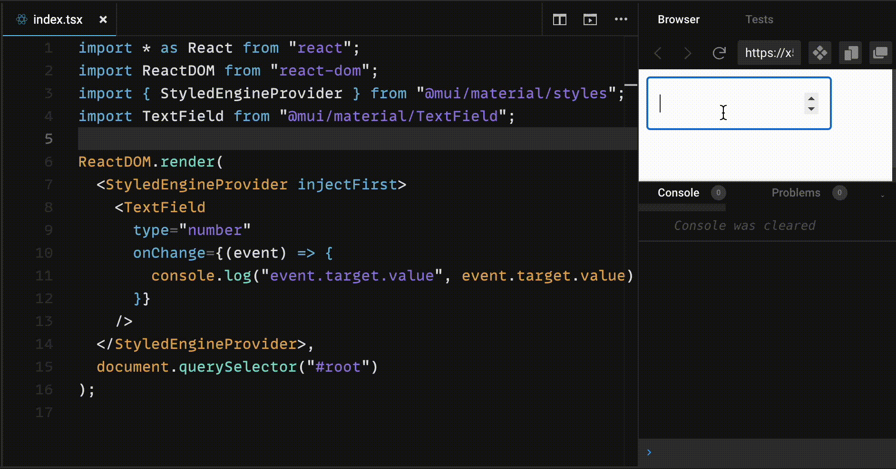
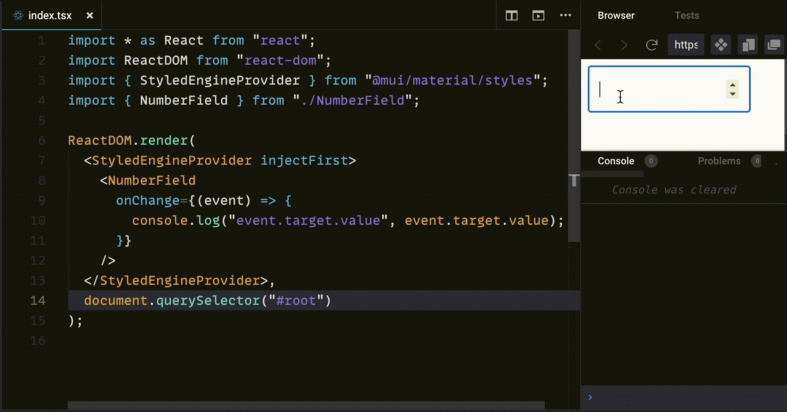

# mui-number-field

A small library that solves a weird behavior of MUI's TextField with type `number`.

## Problem description
If locale settings are set so that decimal separator is `,` (comma) and thousand separator is `.` (dot), then there is an issue with typing decimal numbers and `onChange` event. Check out the animation bellow and pay attention when `.` is typed - `event.target.value` is empty string!

While digits are being typed, `event.target.value` contains them, but when `,` is pressed the `onChange` event is **NOT** fired. Finally, when decimal digits are being typed, `event.target.value` contains a valid decimal number with `.` as a separator. However, if `.` is typed instead of `,`, the `onChange` event **IS** fired with `event.target.value` containing empty string!

Actually, the root cause lies in the HTML `<input>` element, as it behaves in such a way, and thus is transferred to MUI.

## How it works

The library fixes the problem by preventing `onChange` events to be fired in case of pressing `.`, which makes `onChange` behave consistently and the same as if `,` is pressed. Check it out in the animation below.

## Installation

TODO

## TODOs:
1. test with js app
2. check react 18 apps 